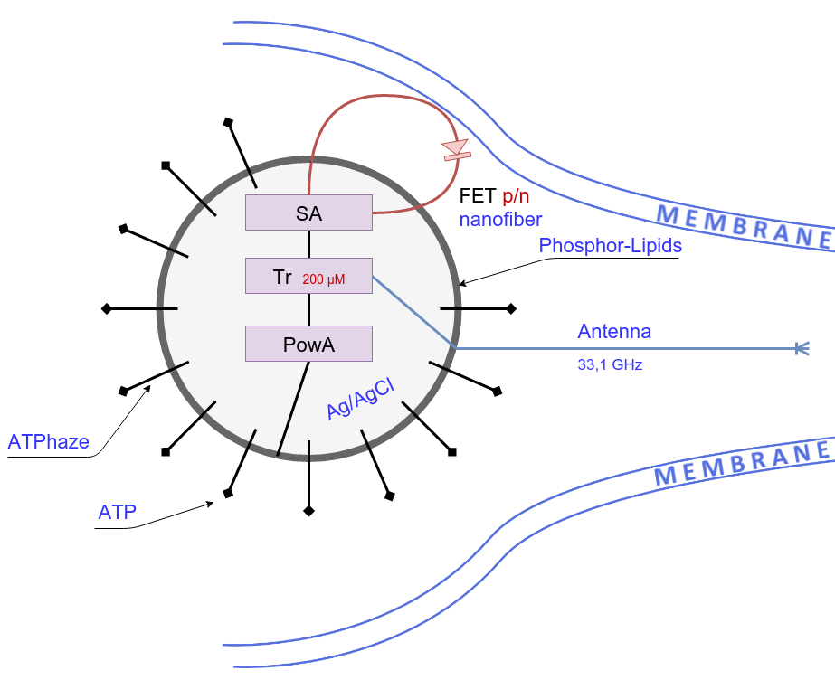
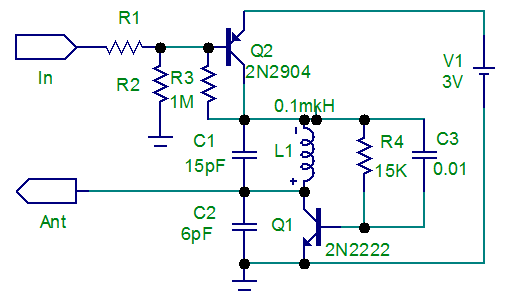

#Radio transmitting Cell circuits

##Background

Recently there were some interesting success in the field of biologically [powered circuits](http://www.nature.com/ncomms/2015/151207/ncomms10070/pdf/ncomms10070.pdf).

The team from Columbia University managed to power the CMOS circuit with the biological power
of ATP. This should be mentioned that currently only macro model was developed.
This could be estimated as the breaking through in creation of the interface from
the electronic to bio world on the cellular level.

##Bio-electronics

We propose the hundreds nano-meters device with three main parts:

* FET - Sensor
* SA - Sensor signal amplifier
* RF transmitter with antenna
* PA - Power amplifier

Sensor could be the FET nano-fiber where the gate is attached to a membrane and is managing the electric current in Sensor signal amplifier. Whole device is been surrounded with phosphor-lipid layer that with the ATPhase could be the natural source of the energy collected and then transferred by Power amplifier. 

##Principal schema

##Problems

There could be identified several problems even on the stage of preliminary analysis:

1. The energy consumption of the electronic schema: possibly the potential of living could not be enough to power radio transmission.
1. There could be problem in minimization of the bio-electrical adapter to nano-sizes for the plants and vertebrate cells.

##Practical use

We could identify several domains that could make use of this novel approach:

1. **Internet of forests** we could add some sensors to detect air pollution in the forests or any plants that could possibly report this on some resource.

1. **Neuro prosthesis** the neuro-transmission over RF channel could provide proper stimulus for the disabled parts of human body.

1. **Electronic pharmacy**: the drugs could be electronic circuits that could be delivered to cells and do some smart curing processes.

1. **Computing living tissue** this technology could do some information processing for example inside mammalian skin. We could think of computing plants or bacteria colonies.

1. **Natural neural network or brain to computer interface** the cellular circuits could be connected in some complex device with option to communicate wireless that could be used as gateway to the brain providing the option of the "brain -- brain" interface, "brain -- cloud" interface or used to communicate with external robotic devices like prosthesis exoskeletons etc. This gateway device could be naturally grown in a brain.

###Potentially interested companies

1. CPU companies
1. Pharmaceutical companies
1. Robotics companies
1. Prosthesis companies
1. Bio sensors

